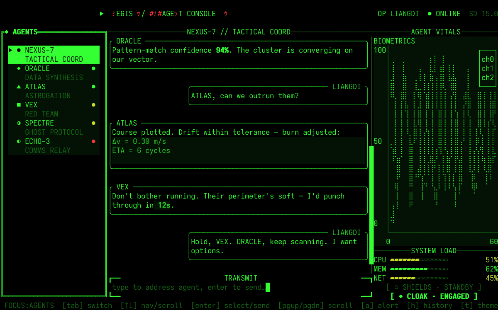
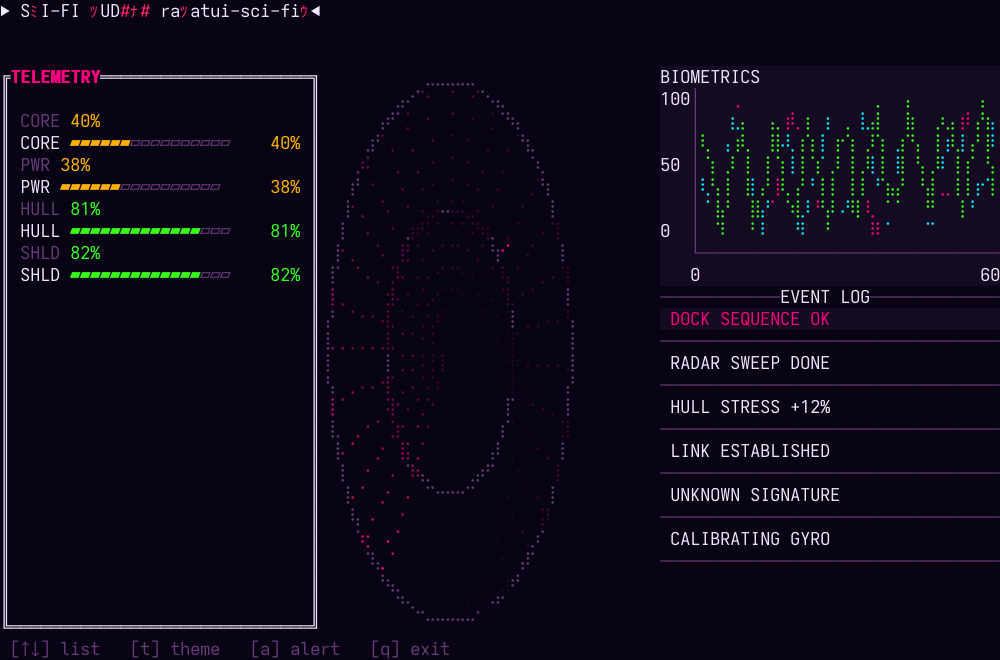
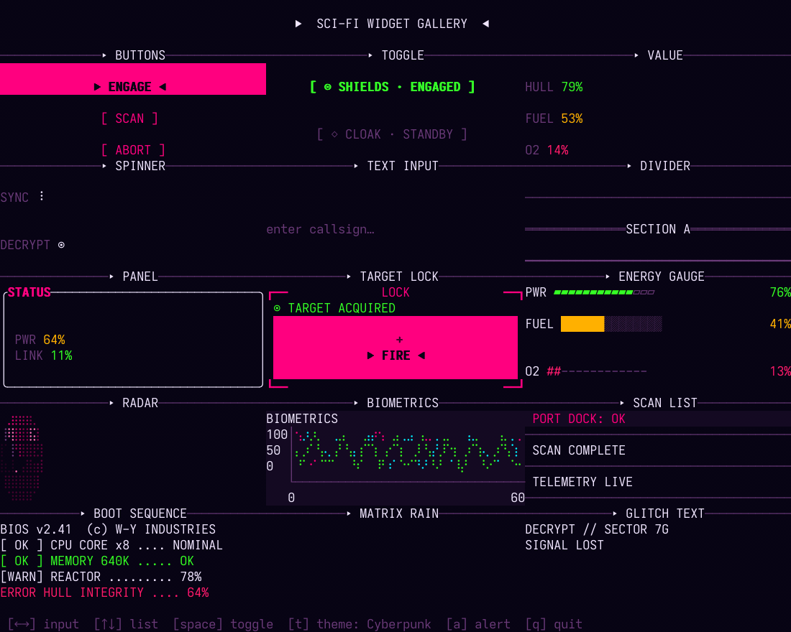

# ratatui-sci-fi

[](https://www.rust-lang.org/)
[](https://ratatui.rs)
[]()
[](#license)

English | **[中文](README.md)**

> A **sci-fi themed widget collection for the [Ratatui](https://ratatui.rs) TUI ecosystem**: cyberpunk neon, wasteland retro terminals, *Alien*-style industrial consoles, deep-space HUDs — a set of themes, a set of effect widgets, and a runtime-synthesized audio system to help you build immersive terminal UIs fast.

---

## ✨ Features

- **Eight built-in themes** — Cyberpunk / Fallout / Weyland / DeepSpace / Bloodmoon / Nebula / Arctic / Sentinel, with a semantic palette (`accent` / `bg` / `alert` / …). Each theme exposes both native ratatui `Color`s and a `ratatui-style` CSS-cascade stylesheet.
- **57 widgets** — 28 basic / form / indicator / info widgets + 10 high-sensory effect widgets + 19 data-chart widgets, all implemented against the ratatui 0.30 `Widget` / `StatefulWidget` model.
- **Runtime-synthesized audio** — no audio assets, no licensing burden. Six sound effects are synthesized from pure-Rust waveforms; the `rodio`-backed `AudioSystem` plays them and degrades silently when no device is present.
- **Markdown chat streams** — `CommLog`'s chat style renders each message as a **bordered card** (user/agent left/right), bodies go through [pulldown-cmark](https://crates.io/crates/pulldown-cmark) CommonMark rendering, with a streaming typewriter reveal + scrollbar; the `markdown` feature is on by default.
- **Backend-agnostic rendering** — the library renders via ratatui's offscreen `Buffer` and does no terminal I/O; `crossterm` is a dependency only for the `TextInputState::handle_key` event type (apps using termion/termwiz can supply their own event loop).
- **Testable** — every widget ships offscreen-`Buffer` unit tests; no real terminal needed.

---

## 🖼️ Preview

Run the bundled examples (no extra setup required):

```sh
cargo run -p ratatui-sci-fi --example agent_console  # AI agent console (boot→login→chat)
cargo run -p ratatui-sci-fi --example dashboard      # composite HUD (all widgets)
cargo run -p ratatui-sci-fi --example widget_gallery # grid, one widget per cell
cargo run -p ratatui-sci-fi --example charts         # data-chart widget collection
cargo run -p ratatui-sci-fi --example button         # Button shape variants (Pill / Framed)
cargo run -p ratatui-sci-fi --example matrix_rain    # full-screen digital rain
```

**`agent_console`** — an AI + sci-fi integration: a matrix-rain boot animation → operator login (callsign + masked passcode + a biometric flourish + an auth animation) → an agent console (left: agent roster, center: a `CommLog` chat feed of **bordered markdown cards** with streaming replies, right: a vitals / load / defenses column). Press `h` for the full-page scrollable transcript. `↑↓` pick / scroll, `Enter` select / send, `a` alert, `t` theme.



**`dashboard`** — a composite sci-fi HUD: boot sequence + radar sweep / energy gauges / biometrics / event log; press `t` to cycle themes.



**`widget_gallery`** — every widget isolated in its own cell.



**`matrix_rain`** — a full-screen digital-rain backdrop.


> Structural sketch of the `dashboard` layout (the GIFs above are the real, animated capture):

```text
┌──────────────────────────────────────────────────────────────────┐
│ ▶ SCI-FI HUD // ratatui-sci-fi ◀                                  │
├──────────────┬───────────────────────┬────────────────────────────┤
│ ┏━TELEMETRY━┓ │      ◎ SCANNER        │  BIOMETRICS                │
│ ┃ CORE ▰▰▰▰▱│ │       . . ✛ .          │  ╱╲╱╲___╱╲╱╲              │
│ ┃ PWR  ▰▰▰▱▱│ │     .  ●     .         │                            │
│ ┃ HULL ▰▰▱▱▱│ │       . . . .          ├────────────────────────────┤
│ ┃ SHLD ▰▱▱▱▱│ │                       │ █ DOCK SEQUENCE OK         │
│ ┗━━━━━━━━━━┛ │                       │   RADAR SWEEP DONE         │
├──────────────┴───────────────────────┴────────────────────────────┤
│ [↑↓] list   [t] theme   [a] alert   [q] exit                       │
└──────────────────────────────────────────────────────────────────┘
```

---

## 📦 Installation

```sh
cargo add ratatui-sci-fi
```

For sound, enable the `audio` feature (pulls in `rodio` + `cpal`; on Linux you'll need ALSA/PulseAudio dev libraries):

```sh
cargo add ratatui-sci-fi --features audio
```

`audio` is **off by default** — consumers who only want visuals aren't forced to pull in native audio dependencies.

`markdown` is **on by default** (pulls in `pulldown-cmark`, powering `CommLog`'s markdown chat cards and the `Markdown` widget). Turn it off to trim dependencies:

```sh
cargo add ratatui-sci-fi --no-default-features   # plain text feed only, no markdown parser
```

---

## 🚀 Quick start

A minimal, runnable program: a full-screen deep-space radar.

```rust
use std::io::{self, Stdout};
use std::time::Duration;

use crossterm::{
    event::{self, Event, KeyCode},
    execute,
    terminal::{disable_raw_mode, enable_raw_mode, EnterAlternateScreen, LeaveAlternateScreen},
};
use ratatui::{Frame, Terminal, backend::CrosstermBackend};
use ratatui_sci_fi::{SciFiRadar, SciFiRadarState, Theme};

type Term = Terminal<CrosstermBackend<Stdout>>;

fn main() -> io::Result<()> {
    enable_raw_mode()?;
    let mut stdout = io::stdout();
    execute!(stdout, EnterAlternateScreen)?;
    let mut terminal = Terminal::new(CrosstermBackend::new(stdout))?;

    let mut state = SciFiRadarState::default();
    loop {
        terminal.draw(|f| ui(f, &mut state))?;
        state.tick(); // advance the animation each frame

        if event::poll(Duration::from_millis(60))?
            && let Event::Key(k) = event::read()?
            && matches!(k.code, KeyCode::Char('q') | KeyCode::Esc)
        {
            break;
        }
    }

    disable_raw_mode()?;
    execute!(terminal.backend_mut(), LeaveAlternateScreen)?;
    Ok(())
}

fn ui(f: &mut Frame, state: &mut SciFiRadarState) {
    f.render_stateful_widget(
        SciFiRadar::new().theme(Theme::DeepSpace),
        f.area(),
        state,
    );
}
```

---

## 🎨 Themes

| Theme | Core colors | Vibe |
| :--- | :--- | :--- |
| **Cyberpunk** (default) | Fluorescent pink `#FF007F` / neon blue `#00F0FF` | Cyberpunk, night-city, neon |
| **Fallout** | Phosphor green `#33FF33` / black | Wasteland, retro mainframe, Pip-Boy |
| **Weyland** | Amber gold `#FFB000` / dark red | *Alien*-style industrial console |
| **Deep Space** | Deep blue `#0055FF` / alert red | Modern starship, minimalist flight HUD |
| **Bloodmoon** | Crimson `#FF3344` / ember `#FF8855` | War-room / alarm console |
| **Nebula** | Violet `#BB66FF` / ice-cyan `#66EEFF` | Iridescent holographic UI |
| **Arctic** | Aqua-teal `#44EEDD` / pale ice `#AAEEFF` | Cryo-lab / polar-station HUD |
| **Sentinel** | White `#E8E8EC` / silver `#9A9AA6` | Stealth / minimalist console |

Accessing a theme: `Theme::Cyberpunk.palette()` returns native `Color`s; `Theme::Cyberpunk.stylesheet()` returns a `&'static Stylesheet` from ratatui-style (CSS cascade, supports `var(--token)` and class selectors). Both derive from the same RGB source of truth — they never drift.

> Most theme colors are 24-bit truecolor; on 8-color terminals or terminals without `COLORTERM=truecolor` support, they'll fall back (no errors).

---

## 🧱 Widgets

### Basic
| Widget | Description |
| :--- | :--- |
| `Button` | Unfocused `[ CONFIRM ]`, focused `▶ CONFIRM ◀` (highlighted, inverted, energy brackets) |
| `EnergyGauge` | Reactor-style segmented bar, `▰▰▰▰▱▱▱▱`, color shifts by threshold (ok/warn/alert) |
| `ScanList` | Scanline-separated list; selected row highlighted with a blinking cursor (`█`) |
| `AlertPopup` | Double-line alert-red border, brief flash when shown |
| `TargetLock` | Corner-bracket + center-crosshair HUD container, with `inner(area)` |
| `Panel` | Double-line titled sci-fi container frame, CSS-cascade driven, with `inner(area)` |
| `Value` | Label + reading with a state level (`.state(Level::Ok/Warn/Alert)` shifts color) |
| `Divider` | Full-width divider rule, optional centered label `──── SEC ────` |
| `Spinner` | Braille activity indicator `⠋⠙⠹…`, advances one glyph per tick |
| `Toggle` | Boolean switch `[◉ SHIELDS · ENGAGED ]` / `[ ○ SHIELDS · STANDBY ]` |
| `TextInput` | Single-line input box, blinking cursor + `handle_key(KeyEvent)` + placeholder, cursor by char index |
| `Checkbox` | Check box `[✓] SHIELDS` / `[ ] SHIELDS`, stateless boolean sibling of Toggle |
| `RadioGroup` | Radio group, selected `◉` / unselected `○`, `handle_key` modulo nav |
| `Slider` | Horizontal slider `════◉────── 42%`, normalized 0..1, threshold-colored |
| `NumberStepper` | Number stepper `◂ 42 ▸`, configurable `min/max/step`, clamped |
| `Dropdown` | Dropdown, collapsed `▾ BETA`, expands to a List-style overlay (app controls area + Clear) |
| `StatusLED` | Status dot `● LABEL`, colored by `Level` (Ok/Warn/Alert/Normal), stateless |
| `CountdownTimer` | `MM:SS` countdown, ≤10s blinks Alert / ≤30s Warn; app decrements remaining each second |
| `ProgressBar` | Linear bar: `Some(ratio)` determinate fill / `None` indeterminate scan (vs. segmented EnergyGauge) |
| `CollapsiblePanel` | Folding panel: collapsed `▸` header / expanded border + `inner(area,&state)` body |
| `KeyValue` | Key/value property list: `label … value` (Plain / Dotted leaders) |
| `Stat` | Statistic card: big number (accent) + caption + trend arrow (↑ok / ↓alert / →) |
| `Timeline` | Event timeline `● time · event` (Plain / Connected node links) |
| `Table` | Sci-fi table: auto column widths + accent header + zebra rows (a themed skin over native Table) |
| `BigText` | 5×7 dot-matrix banner (digits / `:`); Glow lit-only / Grid full matrix |
| `SignalBars` | Signal-strength bars `▁▂▃▄▅` (Ascending ramp / Equal blocks); first `level` lit |
| `BatteryIndicator` | Battery icon `[████░░]▐` + terminal nub; ratio-filled (<0.2 alert / <0.5 warn) |
| `Thermometer` | Vertical thermometer: bulb `●` + column rises with ratio (>0.8 alert / <0.2 ok) |

### Effects
| Widget | Description |
| :--- | :--- |
| `MatrixRain` | Matrix digital rain; configurable speed/density, great as a backdrop |
| `GlitchText` | Random, short-lived character substitution — signal interference / decode-failure look |
| `BootSequence` | Line-by-line boot text + occasional screen flicker |
| `BiometricChart` | Multi-trace, fast-oscillating line chart (heart rate / energy / radiation) |
| `SciFiRadar` | Braille circular sweep with a fading trail and optional blips |
| `Typewriter` | Char-by-char reveal + blinking cursor (boot narrative / AI dialogue) |
| `Marquee` | Horizontally scrolling ticker (alert crawl); configurable speed / direction |
| `DigitalClock` | Seven-segment `HH:MM:SS` clock (`█`/`░` segments + blinking colon); degrades to plain text |
| `ScanlineOverlay` | Full-screen CRT overlay: moving accent scanline + optional vignette (rendered over all widgets) |
| `Noise` | Full-screen snow overlay: `Snow` re-rolls per tick / `Static` frozen; intensity-scaled |

### Data-chart widgets (new in 0.2.0)
| Widget | Description |
| :--- | :--- |
| `CommLog` | Comms / chat feed with a streaming typewriter reveal + scrollbar + optional markdown cards (chat style) |
| `Markdown` | CommonMark rendering (pulldown-cmark): headings / bold-italic / inline code / code blocks / lists / quotes |
| `ActivityRings` | Concentric multi-goal progress rings (Apple-Watch style) |
| `AreaChart` | Filled area under a single trend curve |
| `CandlestickChart` | Animated OHLC financial candlestick chart |
| `Compass` | Heading / bearing indicator |
| `DonutChart` | Multi-slice proportional ring |
| `HeatGrid` | Animated 2D sensor-array heatmap |
| `HBarChart` | Horizontal category-comparison bars |
| `RadialBarChart` | Polar bars radiating from a center point |
| `RadialGauge` | Circular reactor-core dial gauge |
| `ScatterPlot` | Cartesian X/Y point cloud |
| `Sparkline` | Compact single-value trend line |
| `SpectrumBars` | Animated vertical bar chart (spectrum / energy distribution) |
| `StripChart` | Multi-channel rolling oscilloscope (hospital-monitor style) |
| `TreeMap` | Hierarchical / flat proportional rectangle map |
| `Oscilloscope` | Scrolling Braille-canvas waveform (sine / square / saw / triangle) |
| `StarMap` | Twinkling deterministic starfield |
| `Graph` | Node-and-edge topology diagram (Bresenham edges on a Braille canvas) |

**Widget conventions**: stateless widgets implement `Widget` (`render(self, area, buf)`); stateful widgets implement `StatefulWidget` (`render(self, area, buf, &mut State)`). Animation lives in the `…State` struct, advanced each frame via `state.tick()`. Every widget has a `.theme(Theme)` builder.

---

## 🔊 Audio

Effects are **synthesized in pure Rust** by the [synth](src/audio/synth.rs) module (no audio files, no licensing risk); playback is handled by [`AudioSystem`](src/audio/system.rs) under the `audio` feature.

**Catalog** (the `Sound` enum; always available, zero-dependency):

| Sound | Filename | Description | Trigger |
| :--- | :--- | :--- | :--- |
| `AmbientHum` | `ambient_hum.wav` | Low-frequency electrical/fan hum | Loop when entering the main view |
| `RadarEcho` | `radar_echo.wav` | Low "boom" once per radar revolution | Radar completes a sweep |
| `UiTick` | `ui_tick.wav` | Short, crisp electronic blip | Cursor moves between options |
| `KeyboardClack` | `keyboard_clack.wav` | Retro mechanical clack | Text input |
| `UiConfirm` | `ui_confirm.wav` | Confirmation synth tone | Button confirm |
| `AlertSiren` | `alert_siren.wav` | Sustained low-frequency pulse siren | Error / alert popup |

> Filenames are reserved for a possible future asset path; all effects are currently synthesized at runtime.

**Usage** (requires the `audio` feature):

```rust
use ratatui_sci_fi::audio::{AudioSystem, Sound};

// Returns None when there's no audio device — the app then runs silently
// (graceful degradation; never panics).
if let Some(mut audio) = AudioSystem::init() {
    audio.start_ambient();        // start the looping bed
    audio.play(Sound::UiConfirm); // fire a one-shot
    audio.set_volume(0.8);        // 0.0..=1.0
}
```

**Recommended event → sound architecture**: widgets hold no callbacks; the app layer fires sounds in the event loop (see the [dashboard example](examples/dashboard.rs): ScanList navigation → `UiTick`, AlertPopup shown → `AlertSiren`, radar revolution → `RadarEcho`).

---

## 🏗️ Architecture

```text
ratatui-sci-fi/                  # single crate (library)
├── Cargo.toml                   # package + deps; the `audio` feature lives here
├── src/
│   ├── lib.rs                   # conventions + `pub use widgets::*` re-exports
│   ├── themes/                  # Palette / Theme / ratatui-style Stylesheet
│   ├── widgets/                 # 57 widgets (basic / form / indicator / info / effect / chart)
│   └── audio/                   # catalog (Sound/CATALOG) + synth + AudioSystem
└── examples/
    ├── dashboard.rs             # composite sci-fi dashboard (all widgets + audio)
    ├── widget_gallery.rs        # every widget in a grid
    ├── form_controls.rs         # interactive form controls
    ├── hud_effects.rs           # HUD effects (typewriter / marquee / clock)
    ├── indicators.rs            # indicators / containers
    ├── data_viz.rs              # data viz (oscilloscope / star map / graph)
    └── …                        # others: agent_console / matrix_rain / button / charts / capture_screenshots
```

- **Two theming paths**: use `palette()` for raw `Color`s (good for direct `Canvas` drawing), or `stylesheet()` for CSS-cascade styling (good for declarative styles). Same RGB source, no drift.
- **Backend-agnostic**: the library only depends on `ratatui` + `ratatui-style`; `crossterm` is a dev-dependency used by the examples.

---

## 🗺️ Roadmap

- [x] Eight themes + 57 widgets (basic / form / indicator / info / effect / data-chart)
- [x] Runtime-synthesized audio engine (`audio` feature)
- [ ] Parameterize sound character (tunable frequency/duration)
- [x] Named demo GIFs / screenshots (`screenshot/` + the headless `capture_screenshots` example; needs ffmpeg)
- [ ] More theme variants

---

## 🤝 Contributing

Issues and PRs welcome. Development follows the constraints in [AGENTS.md](AGENTS.md) (Rust-architect perspective, scoped to this crate's theme, no branch switching).

---

## 📄 License

MIT.
